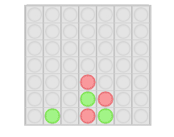

# Connect Four AI #
This repo contains:
- Connect Four AI API written in PHP
- Implemented front-end game in html/javascript

See a live demo here: [http://kevinalbs.com/connect4/](http://kevinalbs.com/connect4/).

The [API](http://kevinalbs.com/connect4/back-end/info.html) accepts a board state and replies with a list of moves and scores. The scores are calculated using a minimax algorithm and a heuristic.